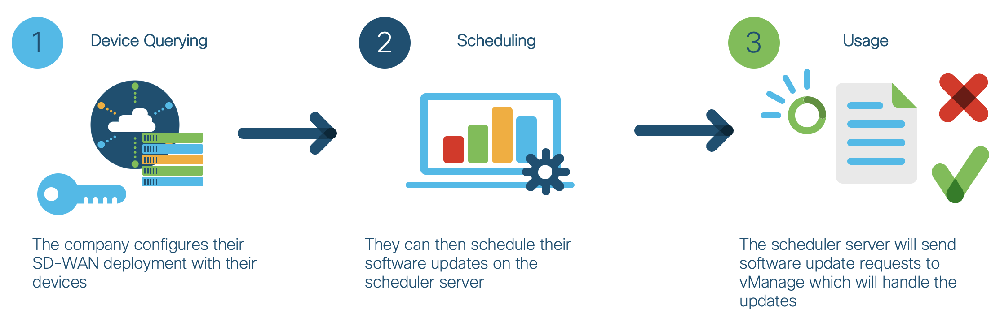
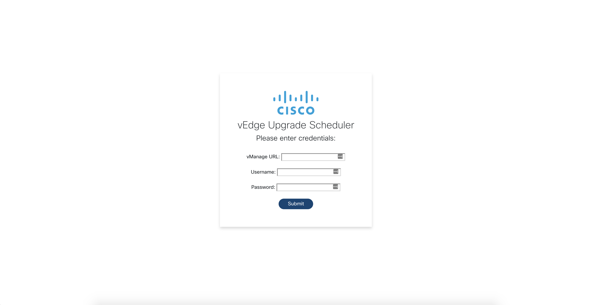
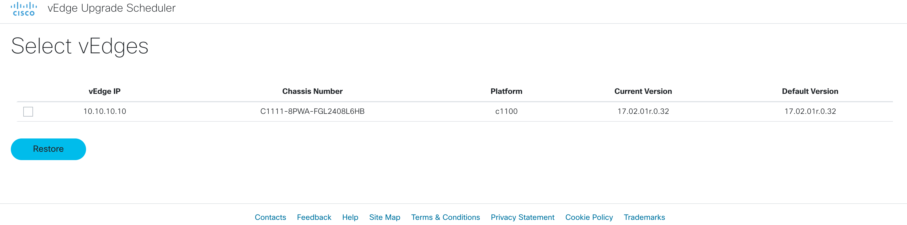
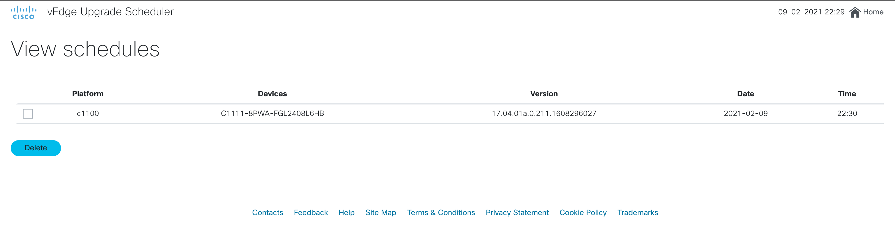

# vEdge Upgrade Scheduler
This is the Cisco SD-WAN vEdge Upgrade Scheduler source code. Using vManage API's, we can configure a schedule for vEdge software
upgrades with specific devices and software versions.

The upgrades are stored in a database which is queried regularly by the server to determine which upgrade jobs should be
done.

### High Level Design


## Contacts

* Josh Ingeniero (jingenie@cisco.com)
* Monica Acosta (moacosta@cisco.com)
* Robert Landires (rlandire@cisco.com)

## Solution Components
* Flask
* Docker
* Python
* JavaScript
* Cisco vManage API’s

## Installation:

#### Clone the repo
```console
$ git clone https://wwwin-github.cisco.com/gve/viptela-update-scheduler.git
```
### Python

#### Set up a Python venv
First make sure that you have Python 3 installed on your machine. We will then be using venv to create
an isolated environment with only the necessary packages.

##### Install virtualenv via pip
```
pip install virtualenv
```

##### Create a new venv
```
# Change to your project folder
cd viptela-upgrade

# Create the venv
virtualenv venv

# Activate your venv
source venv/bin/activate
```

#### Install dependencies
```zsh
pip3 install -r requirements.txt
```


### Docker
You have the option to use a docker image hosted in this repo
or to build the docker image from this repo. You may edit [docker-compose.yml](docker-compose.yml) to use one of the following options:
```yaml
# To build from scratch and generate an image
build: .
# To pull the image from GitHub docker
image: docker.pkg.github.com/gve-sw/gve_devnet_vedge_upgrade_scheduler/vedge_upgrade_scheduler:latest
```
Pulling the image requires a personal access token from Github. Follow this [guide](https://docs.github.com/en/github/authenticating-to-github/creating-a-personal-access-token)
to generate an access token with the ```read:packages``` scope.

Afterwards, you would need to log in to docker with your Github username and personal access token.
```commandline
docker login https://docker.pkg.github.com -u USERNAME -p PERSONAL_ACCESS_TOKEN
```

You can also edit the timezone used in scheduling in the same file:
```yaml
environment:
      TZ: "Asia/Singapore"
```
A list of valid timezones is available at https://en.wikipedia.org/wiki/List_of_tz_database_time_zones under _TZ Database Name

## Setup:
You can deploy this prototype in a lab environment, dCloud instance, or on your own deployment.
You would then need to either input your details through the web GUI or edit a config file below.

#### vManage details:
You need to have your _VMANAGE IP Address, USERNAME, and PASSWORD_ /

Fill in the details of your SD-WAN deployment in the [DETAILS.py](viptela-upgrade/DETAILS.py) file or enter them while logging in.
```python
HOST = ''
USERNAME = ''
PASSWORD = ''
```

## Usage:

### Python
Launch the Scheduler Server. Make sure that you have your venv activated.
```commandline
flask run --host=0.0.0.0 --port=5000
```

### Docker
Launch the Scheduler Server through the docker-compose file.
```commandline
docker-compose up
```

### Running
Launch your web browser and navigate to [localhost:5000](localhost:5000) or with your configured port.


### Login Screen


### Device Selection


### Upgrade Scheduling


## License
Provided under Cisco Sample Code License, for details see [LICENSE](./LICENSE.txt)

## Code of Conduct
Our code of conduct is available [here](./CODE_OF_CONDUCT.md)

## Contributing
See our contributing guidelines [here](./CONTRIBUTING.md)